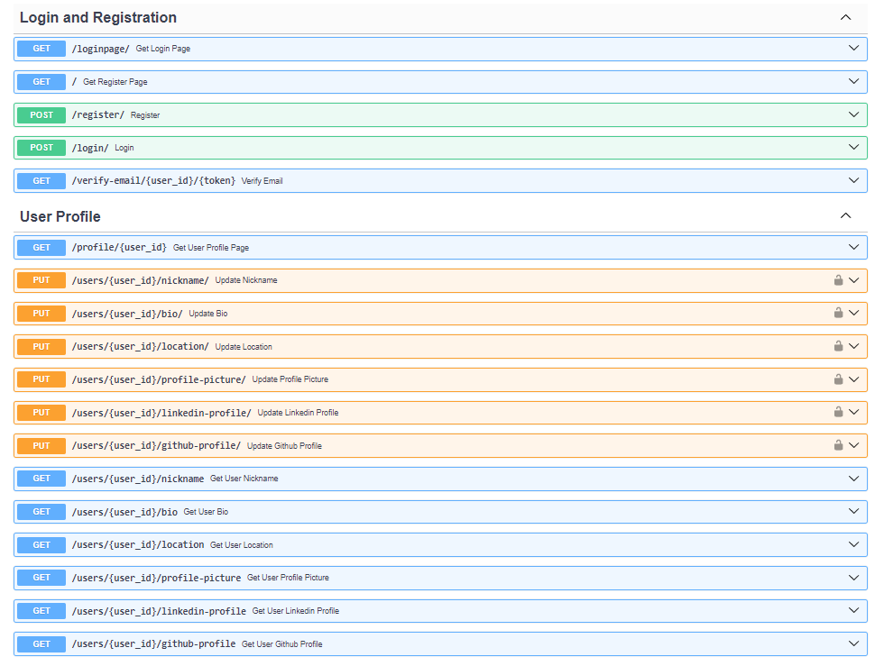
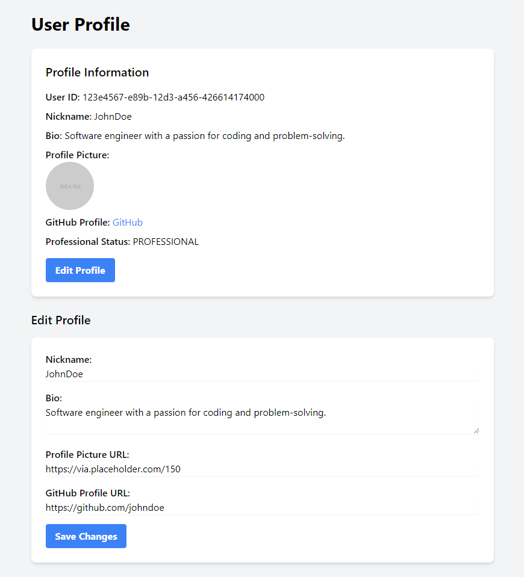
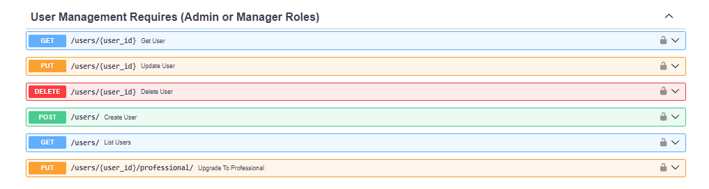
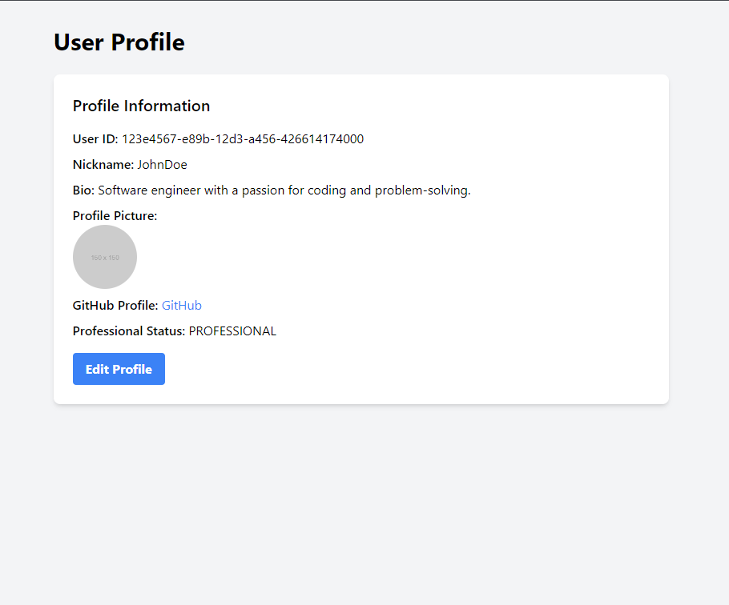

- **Description:** Enhance the user profile management functionality to allow users to update their profile fields and enable managers and admins to upgrade users to professional status.
- **User Story:** As a user, I want to be able to manage my profile information and get upgraded to professional status by managers or admins.
- **Minimum Viable Feature:**
  - Implement API endpoints for users to update their profile fields, such as name, bio, location, etc.
    
     
  - Create a separate API endpoint for managers and admins to upgrade a user to professional status.
    
  - Update the user profile page to display the professional status and allow users to edit their profile fields.
    
  - Send notifications to users when their professional status is upgraded.

the following tests were created
4 TESTS
https://github.com/ciaraugasmoy/final_project_is219/commit/267634df06d36bb4de54cfb0112c0b2fea22e126
4 TESTS
https://github.com/ciaraugasmoy/final_project_is219/commit/07d02a01969295b4de32791a5de428ac58811cd6
2 TESTS
https://github.com/ciaraugasmoy/final_project_is219/commit/bd83cf3032da4f7fa9be53a864dacfa62fcc4c3b
1 TEST
https://github.com/ciaraugasmoy/final_project_is219/commit/b39394c1c1705e5e1206728deb78f7413f65ea76

5 qa issues
The tests regarding validation of urls assured the quality of data (3 urls)
The tests also ensured the user data was valid, eg username etc
The tests regarding put requests ensured a smooth user experience
The interface also made it easy for user to navigate
The tests considered edge cases of data ensuring the system  could handle it
